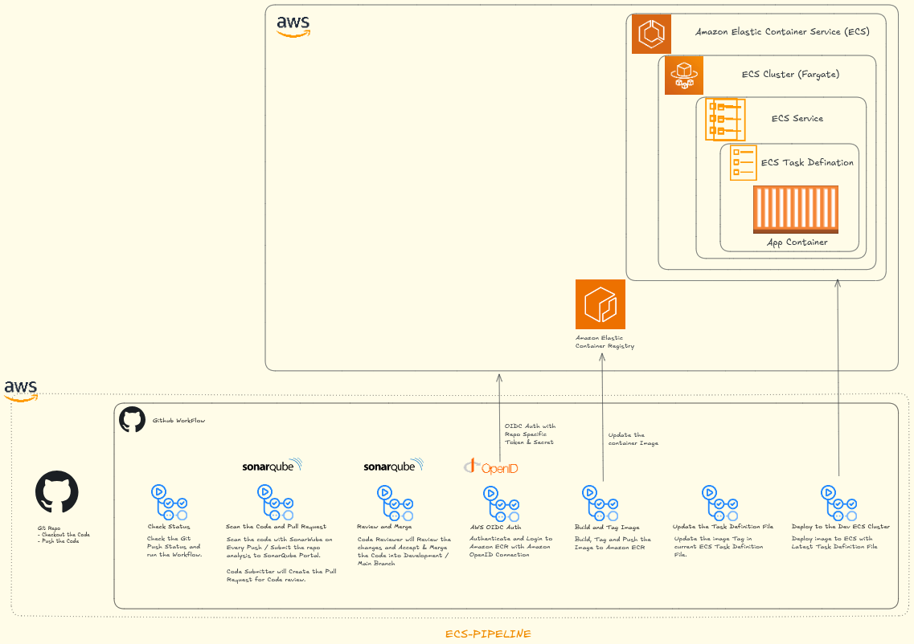

<div align="center">
  


# AWS ECS Fargate Nginx - Pipeline CI/CD Unificado com GitHub Actions & OIDC

**Atualizado: 14 de Janeiro de 2026**

[](https://github.com/nicoleepaixao)
[](https://github.com/nicoleepaixao/aws-ecs-fargate-nginx-oidc-pipeline)
[](https://nicoleepaixao.medium.com/)

<p align="center">
  <a href="README-PT.md">🇧🇷</a>
  <a href="README.md">🇺🇸</a>
</p>

</div>

---

<p align="center">
  
</p>

## **O Problema**

Pipelines CI/CD tradicionais requerem armazenar **credenciais AWS de longa duração** (Access Keys) em GitHub Secrets, o que cria riscos de segurança:

- **Credenciais podem ser roubadas** se o repositório for comprometido
- **Sem rotação automática** de credenciais
- **Auditoria difícil** de quem usou credenciais e quando
- **Permissões amplas** frequentemente concedidas por simplicidade

Este projeto implementa autenticação **GitHub Actions OIDC**, eliminando a necessidade de credenciais armazenadas enquanto mantém deployments seguros e automatizados para AWS ECS Fargate.

---

## **Solução**

Este repositório fornece um **pipeline CI/CD único e pronto para produção** que:

✅ **Zero credenciais de longa duração** - Usa OIDC para acesso temporário AWS  
✅ **Builds automatizados** - Constrói imagens Docker em cada commit  
✅ **Multi-ambiente inteligente** - Detecta automaticamente homol (develop) e prod (main)  
✅ **Deployments seguros** - Push para ECR e deploy para ECS automaticamente  
✅ **Pipeline unificado** - Workflow único que se adapta ao ambiente  
✅ **GitOps** - Infraestrutura como código com trilha de auditoria completa

---

## **Estrutura do Projeto**

```text
aws-ecs-fargate-nginx-oidc-pipeline/
│
├── .github/
│   └── workflows/
│       ├── deploy.yml                # Pipeline unificado (único)
│       └── pr-validation.yml         # Validação de PR
│
├── config/
│   ├── homol.env                     # Configuração homologação
│   └── prod.env                      # Configuração produção
│
├── Dockerfile                        # Container Nginx
├── nginx.conf                        # Configuração Nginx
├── html/
│   └── index.html                    # Conteúdo estático
└── scripts/
    └── deploy-helper.sh              # Scripts auxiliares (opcional)
```

---

## **Secrets GitHub Necessários**

Configure **apenas 2 secrets** no GitHub (`Settings > Secrets and variables > Actions`):

| **Secret** | **Descrição** | **Exemplo** |
|------------|-----------------|-------------|
| `AWS_ROLE_ARN_HOMOL` | ARN da role IAM para homologação | `arn:aws:iam::123456789012:role/GitHubActionsRole-nginx-homol` |
| `AWS_ROLE_ARN_PROD` | ARN da role IAM para produção | `arn:aws:iam::123456789012:role/GitHubActionsRole-nginx-prod` |

**Só isso! Não precisa de AWS_ACCOUNT_ID ou Access Keys!**

---

## **Como o Pipeline Unificado Funciona**

### **1. Detecção Automática de Ambiente**

```yaml
# Job: setup
# Detecta branch e define automaticamente todas as variáveis

develop → homologation
  ├── ECS Service: nginx-service-homol
  ├── Task Definition: nginx-homol
  └── Role ARN: AWS_ROLE_ARN_HOMOL

main → production
  ├── ECS Service: nginx-service-prod
  ├── Task Definition: nginx
  └── Role ARN: AWS_ROLE_ARN_PROD
```

### **2. Estratégia de Tags**

O pipeline cria múltiplas tags para rastreabilidade:

```bash
# Para HOMOLOGAÇÃO (develop)
{ECR_REPO}:{SHA}                    # Ex: ecr_nginx:a1b2c3d
{ECR_REPO}:homologation-{SHA}       # Ex: ecr_nginx:homologation-a1b2c3d

# Para PRODUÇÃO (main)
{ECR_REPO}:{SHA}                    # Ex: ecr_nginx:a1b2c3d
{ECR_REPO}:production-{SHA}         # Ex: ecr_nginx:production-a1b2c3d
{ECR_REPO}:latest                   # Ex: ecr_nginx:latest (apenas prod)
```

### **3. Resumo de Deployment**

Ao final de cada deployment, o pipeline gera um resumo automático:

```text
🚀 Resumo do Deployment

| Item              | Valor                           |
|-------------------|---------------------------------|
| Ambiente          | production                      |
| Serviço           | nginx-service-prod              |
| Cluster           | my-cluster                      |
| Imagem            | 123.ecr.../ecr_nginx:a1b2c3d   |
| Commit            | a1b2c3d                         |
| Deploy por        | @nicoleepaixao                  |
| URL Aplicação     | http://my-alb-123.us-east-1.elb.amazonaws.com |

✅ Deployment concluído com sucesso!
```

---

## **Configuração Rápida**

### **Passo 1: Clonar o Repositório**

```bash
git clone https://github.com/nicoleepaixao/aws-ecs-fargate-nginx-oidc-pipeline.git
cd aws-ecs-fargate-nginx-oidc-pipeline
```

---

### **Passo 2: Configurar Ambientes GitHub**

Crie dois ambientes no GitHub (`Settings > Environments`):

1. **homologation** - Para deployments de staging
2. **production** - Para deployments de produção

**Regras de proteção recomendadas para produção:**
- ✅ Revisores obrigatórios (pelo menos 1)
- ✅ Timer de espera (5-10 minutos)
- ✅ Branches de deployment: apenas `main`

---

### **Passo 3: Atualizar Variáveis**

Edite `.github/workflows/deploy.yml` e ajuste variáveis no topo:

```yaml
env:
  AWS_REGION: us-east-1          # Sua região AWS
  ECR_REPOSITORY: ecr_nginx       # Nome do seu repositório ECR
  ECS_CLUSTER: my-cluster         # Nome do seu cluster ECS
  CONTAINER_NAME: nginx           # Nome do container na task definition
```

E no job `setup`, ajuste nomes de serviço e task definition:

```yaml
# Para PRODUÇÃO (main)
echo "ecs-service=nginx-service-prod" >> $GITHUB_OUTPUT
echo "task-definition=nginx" >> $GITHUB_OUTPUT

# Para HOMOLOGAÇÃO (develop)
echo "ecs-service=nginx-service-homol" >> $GITHUB_OUTPUT
echo "task-definition=nginx-homol" >> $GITHUB_OUTPUT
```

---

### **Passo 4: Adicionar Secrets GitHub**

1. Vá para `Settings > Secrets and variables > Actions`
2. Clique em `New repository secret`
3. Adicione os 2 secrets:

**Secret 1:**
- Nome: `AWS_ROLE_ARN_HOMOL`
- Valor: `arn:aws:iam::SUA_CONTA:role/GitHubActionsRole-nginx-homol`

**Secret 2:**
- Nome: `AWS_ROLE_ARN_PROD`
- Valor: `arn:aws:iam::SUA_CONTA:role/GitHubActionsRole-nginx-prod`

---

### **Passo 5: Testar o Pipeline**

**Para Homologação:**
```bash
git checkout -b develop
git add .
git commit -m "test: deployment homologação"
git push origin develop
```

**Para Produção:**
```bash
git checkout main
git add .
git commit -m "feat: deployment produção"
git push origin main
```

Monitore em `Actions` → Veja o pipeline detectar automaticamente o ambiente!

---

## **Fluxo de Desenvolvimento**

```text
Fluxo Completo:
┌─────────────────────────────────────────────────────────────┐
│ 1. Criar branch de feature                                   │
│    git checkout -b feature/nova-feature develop              │
│                                                              │
│ 2. Desenvolver e commitar                                   │
│    git add .                                                 │
│    git commit -m "feat: adicionar feature X"                │
│                                                              │
│ 3. Push e criar PR para develop                             │
│    git push origin feature/nova-feature                     │
│    → Validação de PR executa (builds + testes)              │
│                                                              │
│ 4. Merge PR para develop                                    │
│    → Pipeline detecta: branch=develop                       │
│    → Deploy AUTOMÁTICO para HOMOLOGAÇÃO                     │
│                                                              │
│ 5. Testar em ambiente de homologação                        │
│    → Validar features                                       │
│                                                              │
│ 6. Criar PR de develop para main                            │
│    → Validação de PR executa novamente                      │
│    → Requer aprovação (se configurado)                      │
│                                                              │
│ 7. Merge PR para main                                       │
│    → Pipeline detecta: branch=main                          │
│    → Deploy AUTOMÁTICO para PRODUÇÃO                        │
│    → Timer de espera + aprovação (se configurado)           │
└─────────────────────────────────────────────────────────────┘
```

---

## **Vantagens do Pipeline Unificado**

### **Manutenção Simplificada**
- **Pipeline único** para gerenciar
- **Mudanças propagam** para todos ambientes
- **Menos duplicação** de código

### **Consistência**
- **Mesmo processo** para homol e prod
- **Mesma qualidade** em todos ambientes
- **Reduz erros** de configuração

### **Segurança**
- **OIDC para ambos** ambientes
- **Roles separadas** com permissões específicas
- **Auditoria completa** via CloudTrail

### **Flexibilidade**
- **Fácil adicionar** novos ambientes
- **Customização** por ambiente no GitHub
- **Tags inteligentes** para rastreabilidade

---

## **Monitoramento**

### **Dashboard GitHub Actions**

1. Vá para `Actions` → `Deploy to AWS ECS`
2. Veja qual ambiente foi detectado
3. Acompanhe logs em tempo real
4. Verifique resumo de deployment

### **Comandos AWS CLI**

**Ver status do deployment:**
```bash
aws ecs describe-services \
  --cluster my-cluster \
  --services nginx-service-prod \
  --query 'services[0].{status:status,events:events[0:3]}'
```

**Listar imagens no ECR:**
```bash
aws ecr list-images \
  --repository-name ecr_nginx \
  --query 'imageIds[*].[imageTag]' \
  --output table
```

---

## **Rollback**

### **Método 1: Git Revert (Recomendado)**

```bash
# Reverter último commit
git revert HEAD
git push origin main  # Dispara novo deployment com código anterior
```

### **Método 2: Redeploy Task Definition Anterior**

```bash
# Listar revisões
aws ecs list-task-definitions --family-prefix nginx --sort DESC

# Atualizar para revisão anterior
aws ecs update-service \
  --cluster my-cluster \
  --service nginx-service-prod \
  --task-definition nginx:5  # Número da revisão anterior
```

---

## **Troubleshooting**

| **Erro** | **Causa** | **Solução** |
|----------|-----------|-------------|
| `Branch not configured` | Push para branch não mapeada | Adicionar branch no job `setup` |
| `Unable to assume role` | Política de confiança incorreta | Verificar política de confiança IAM role |
| `Permission denied` | Role sem permissões | Adicionar permissões necessárias |
| `Service didn't stabilize` | Health checks falhando | Verificar target group ALB |

---

## **Melhores Práticas**

### **Segurança**

✅ Usar roles IAM separadas para homol e prod  
✅ Habilitar proteção de branch em `main`  
✅ Exigir revisões de pull request  
✅ Usar GitHub Environments com aprovações  
✅ Habilitar escaneamento de imagens ECR  
✅ Não rotacionar nada (OIDC cuida disso!)

### **Deployment**

✅ Sempre testar em homologação primeiro  
✅ Usar versionamento semântico para tags  
✅ Marcar imagens de produção com SHA git  
✅ Habilitar circuit breaker de deployment ECS  
✅ Definir grace period apropriado de health check  
✅ Monitorar métricas e alarmes CloudWatch

### **Qualidade de Código**

✅ Executar linting em PRs  
✅ Incluir testes automatizados  
✅ Usar builds Docker multi-stage  
✅ Escanear vulnerabilidades de segurança  
✅ Manter imagens Docker mínimas

---

## **Pré-requisitos**

Antes de usar este pipeline, você deve ter:

1. **Infraestrutura AWS deployada** - Siga [aws-ecs-fargate-nginx-awscli](https://github.com/nicoleepaixao/aws-ecs-fargate-nginx-awscli)
2. **OIDC configurado na AWS** - Siga [aws-github-oidc-pipeline](https://github.com/nicoleepaixao/aws-github-oidc-pipeline)
3. **Repositório GitHub** com permissões apropriadas
4. **Cluster ECS, serviço e task definitions** já criados

---

## **Como OIDC Funciona**

**Método Tradicional (Inseguro):**
```text
GitHub Secrets → Access Key AWS estática → Armazenada para sempre → Risco de segurança
```

**Método OIDC (Seguro):**
```text
GitHub gera token JWT → AWS valida token → Credenciais temporárias (15 min) → Expiram automaticamente
```

**Principais Benefícios:**
1. **Sem credenciais armazenadas** - Nada para roubar ou rotacionar
2. **Acesso temporário** - Credenciais expiram automaticamente
3. **Permissões granulares** - Escopo para repos/branches específicos
4. **Trilha de auditoria completa** - CloudTrail registra cada ação
5. **Amigável compliance** - Atende melhores práticas de segurança

---

## **Roles IAM Necessárias**

Você precisa de duas roles IAM (criadas via [aws-github-oidc-pipeline](https://github.com/nicoleepaixao/aws-github-oidc-pipeline)):

1. **GitHubActionsRole-nginx-homol** - Para deployments de homologação
2. **GitHubActionsRole-nginx-prod** - Para deployments de produção

**Permissões necessárias para ambas roles:**

```json
{
  "Version": "2012-10-17",
  "Statement": [
    {
      "Effect": "Allow",
      "Action": [
        "ecr:GetAuthorizationToken",
        "ecr:BatchCheckLayerAvailability",
        "ecr:GetDownloadUrlForLayer",
        "ecr:BatchGetImage",
        "ecr:PutImage",
        "ecr:InitiateLayerUpload",
        "ecr:UploadLayerPart",
        "ecr:CompleteLayerUpload"
      ],
      "Resource": "*"
    },
    {
      "Effect": "Allow",
      "Action": [
        "ecs:DescribeServices",
        "ecs:DescribeTaskDefinition",
        "ecs:DescribeTasks",
        "ecs:ListTasks",
        "ecs:RegisterTaskDefinition",
        "ecs:UpdateService"
      ],
      "Resource": "*"
    },
    {
      "Effect": "Allow",
      "Action": [
        "iam:PassRole"
      ],
      "Resource": [
        "arn:aws:iam::*:role/ecsTaskExecutionRole",
        "arn:aws:iam::*:role/ecsTaskRole-nginx"
      ]
    }
  ]
}
```

---

## **Funcionalidades Avançadas**

### **Deployments Blue/Green**

Modificar workflow para usar deployment Blue/Green ECS:

```yaml
- name: Deploy com Blue/Green
  run: |
    aws deploy create-deployment \
      --application-name AppECS-my-cluster-nginx-service \
      --deployment-group-name DgpECS-my-cluster-nginx-service \
      --revision revisionType=S3,s3Location={bucket=my-codedeploy-bucket,key=task-def.json,bundleType=JSON}
```

### **Deployments Canary**

Usar configuração de deployment ECS para canary:

```yaml
- name: Deploy com Canary
  run: |
    aws ecs update-service \
      --cluster my-cluster \
      --service nginx-service-prod \
      --task-definition nginx:latest \
      --deployment-configuration "maximumPercent=200,minimumHealthyPercent=50,deploymentCircuitBreaker={enable=true,rollback=true}"
```

### **Notificações Slack**

Adicionar step de notificação Slack:

```yaml
- name: Notificar Slack
  if: always()
  uses: 8398a7/action-slack@v3
  with:
    status: ${{ job.status }}
    text: 'Deployment para produção: ${{ job.status }}'
    webhook_url: ${{ secrets.SLACK_WEBHOOK }}
```

---

## **Projetos Relacionados**

- [Configuração Infraestrutura AWS ECS](https://github.com/nicoleepaixao/aws-ecs-fargate-nginx-awscli) - Deployment completo de infraestrutura com AWS CLI
- [Configuração AWS GitHub OIDC](https://github.com/nicoleepaixao/aws-github-oidc-pipeline) - Setup OIDC para zero credenciais de longa duração

---

## **Recursos Adicionais**

- [GitHub Actions OIDC Documentation](https://docs.github.com/en/actions/deployment/security-hardening-your-deployments/configuring-openid-connect-in-amazon-web-services)
- [AWS ECS Deployment Best Practices](https://docs.aws.amazon.com/AmazonECS/latest/bestpracticesguide/deployment.html)
- [GitHub Actions for AWS](https://github.com/aws-actions)

---

## **Contribuindo**

Contribuições são bem-vindas! Por favor:

1. Faça fork do repositório
2. Crie uma branch de feature (`git checkout -b feature/funcionalidade-incrivel`)
3. Commit suas mudanças (`git commit -m 'feat: adicionar funcionalidade incrível'`)
4. Push para a branch (`git push origin feature/funcionalidade-incrivel`)
5. Abra um Pull Request

---

## **Licença**

Este projeto está licenciado sob a Licença MIT - veja o arquivo LICENSE para detalhes.

---

## **Conecte-se & Siga**

<div align="center">

[](https://github.com/nicoleepaixao)
[](https://www.linkedin.com/in/nicolepaixao/)
[](https://medium.com/@nicoleepaixao)

</div>

---

<div align="center">

**Automatize seus deployments com segurança usando OIDC!**

*Documento Criado: 14 de Janeiro de 2026*

Made with ❤️ by [Nicole Paixão](https://github.com/nicoleepaixao)

</div>
